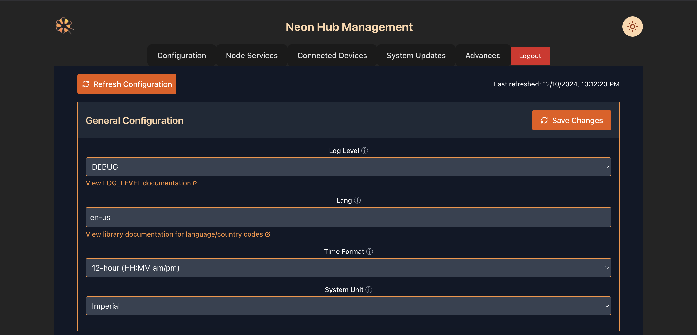
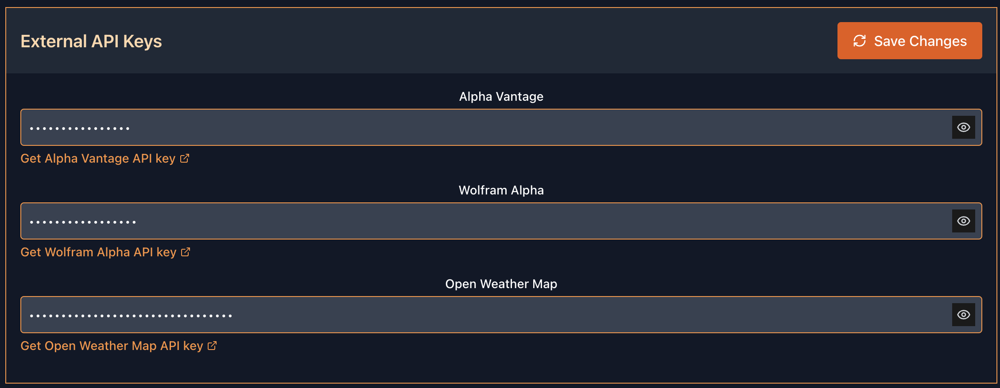
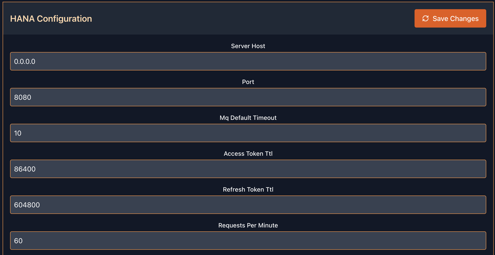
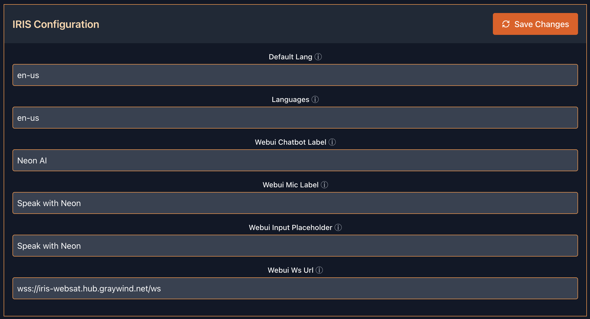
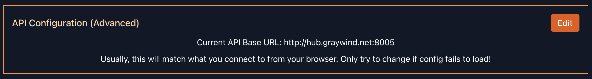

# Hub Configuration UI

Neon Hub ships with a configuration UI. It is available on port 8005, or at `config.neon-hub.local` by default. It is also the default web service for the Neon Hub, so you can access it at `https://neon-hub.local` by default. The configuration UI allows you to set common configuration values without editing files in your Neon Hub system.

## Authentication

The Neon Hub Configuration UI ships with the default username and password of `neon:neon`. These values are configurable as environment variables on the container and can be changed using the `yacht` interface.

!!! warning
    This basic authentication is a minor deterrent and not a full security feature. Always change the default password!

## Configuration

For all sections, when you have made your selections, click `Save Changes` to save the configuration to the relevant file. Most changes will require a service restart.

### General Configuration

The General Configuration section allows the user to configure the log level (defaults to INFO), language (defaults to United States English), time format (defaults to 12-hour), and system unit (defaults to Imperial).

To see more information on valid values, click on or hover over the information icon (a circled letter i) or click the link if it is available.

## External API Keys

Neon Hub ships with skills for Alpha Vantage (stock prices), Wolfram Alpha (an answer engine, particularly good at mathematical and scientific questions), and Open Weather Map (local weather information). For convenience, these services default to using Neon AI®'s central server API keys. However, to guarantee your privacy, you can use your own API keys.

The keys are hidden by default, but can be toggled visible by clicking the eye icon.

To get an API key for each service, click on the link provided and follow their instructions.

### HANA Configuration

!!! warning
    Most users should not edit these configurations. They are provided here as a convenience.

[Neon HANA](https://github.com/NeonGeckoCom/neon-hana), or HTTP API for Neon Applications, is a highly configurable service. While most users will not want to edit these settings, take note of the Node Username and Node Password sections. These will allow you to connect a Neon Node to your Neon Hub. If you change them, existing Nodes must be updated to match in order to reconnect.

For more information on what each setting does, please reference the Neon HANA repository link above.

After making changes, be sure to restart the `neon-hana` service in yacht.

### IRIS Configuration

[Neon IRIS](https://github.com/NeonGeckoCom/neon-iris), or Interactive Relay for Intelligence Systems, offers a Gradio or Web Satellite interface into your Neon Hub.

Most users will need to configure the `Webui Ws Url` value before they can use the IRIS systems that come with Neon Hub. If you have configured DNS to point to your Hub, use that value. Otherwise, use the IP address of your Hub. An insecure `ws` connection will not be accepted by your browser without additional advanced configuration.

Examples: `wss://iris-websat.mycompany.com/ws` or `wss://192.168.1.42/ws`.

### API Configuration (Advanced)

!!! warning
    Most users will not need to touch this setting. Do not change it unless you are instructed by support or feel absolutely confident that you know what you are doing.

If you need to change your Hub Configuration UI's URL, or are experiencing issues using DNS, you can set it manually here. Please note that you must point to an address that your web browser can reach.

In the example above, I have configured my local DNS to point at my Neon Hub using the URL `hub.graywind.net`. I am also hardcoding port 8005 instead of relying on the `neon-nginx` service for the Hub Configuration. This is nonstandard! The default that comes with your Neon Hub will work for most users.

## Node Services

This page is not yet implemented.

## Connected Devices

This page is not yet implemented.

## System Updates

This page is a placeholder that refers the user to the `yacht` service for managing their container services.

## Advanced

!!! danger
    Mistakes in this section can break your Neon Hub. Always, always make a backup of the configuration files before editing!

For users who don't want to edit files directly on their Neon Hub, the Advanced tab offers an editor for both `neon.yaml` and `diana.yaml`. To get the latest file contents, press `Refresh` for the relevant configuration.

Each editor does YAML syntax highlighting for easy viewing. It also has a basic YAML validator that disables saving the configuration if you have input invalid YAML. Incorrect configuration can still break your Neon Hub, but this helps prevent one of the most common causes of configuration errors.

!!! warning
All passwords and secret values are viewable in plaintext here.  There is no way to obscure them in the Advanced tab.
